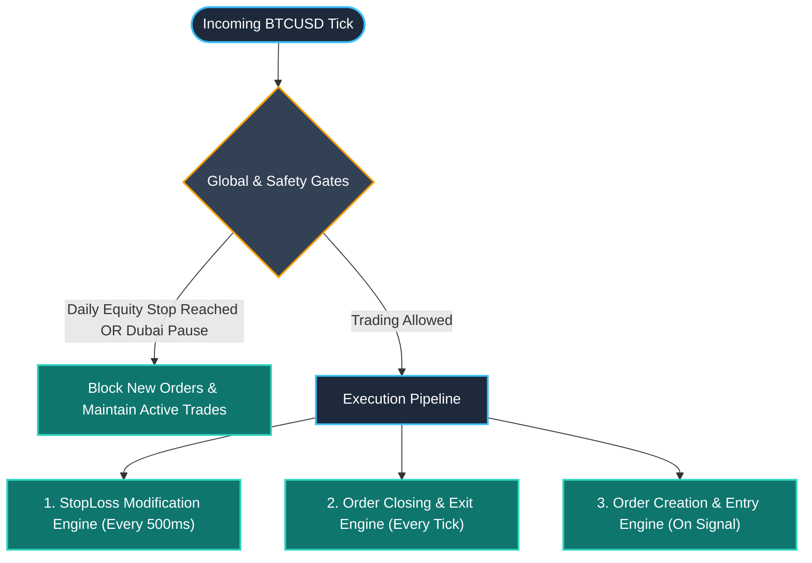
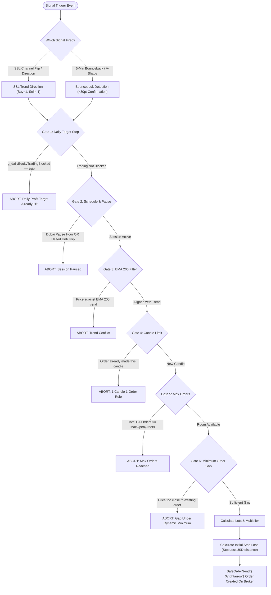
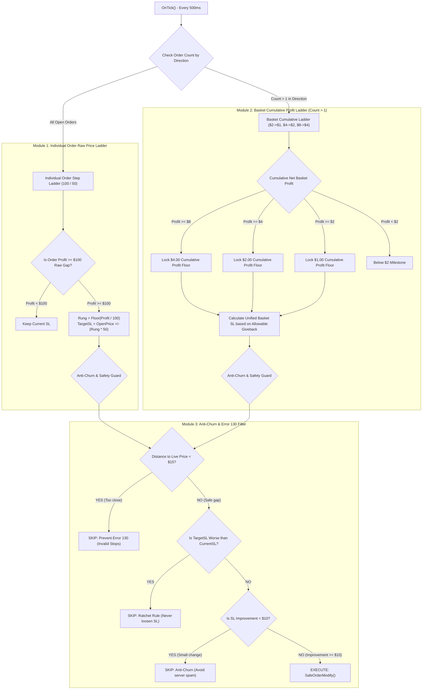
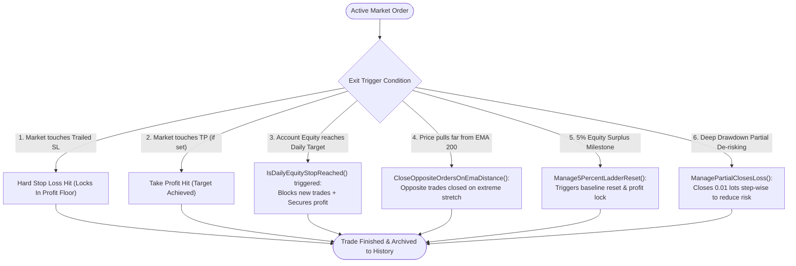
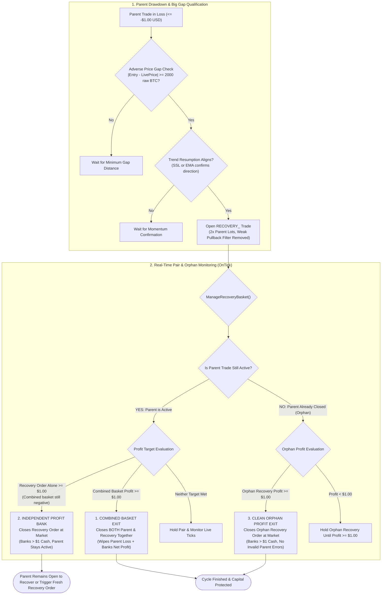

# Complete Trading Lifecycle & Execution Flowchart

This document provides a visual guide and technical breakdown of the complete trading lifecycle for the **BTCUSD Scalping Expert Advisor** ([`SSLCHANEL-1.mq4`](file:///c:/Users/venuadmin/AppData/Roaming/MetaQuotes/Terminal/2191F4A3D14D7B4B1EBB84F924777883/MQL4/Experts/SSLCHANEL-1.mq4)).

---

## 1. High-Level Master Architecture

---

## 2. Order Creation Engine (When & How Orders Open)

Orders are only opened when an indicator signal occurs **AND** passes 8 layers of strict risk, timing, and gap filters.

### Detailed Order Creation Conditions:
| Stage | Condition | Purpose |
| :--- | :--- | :--- |
| **Signal Trigger** | SSL Indicator Direction = 1 (Bullish) or -1 (Bearish) | Primary entry signal |
| **Gate 1** | `!g_dailyEquityTradingBlocked` | Stop trading once daily equity goal is met |
| **Gate 2** | `!IsDubaiTradingPauseHour()` & `!TradingHaltedUntilNextFlip` | Avoid dead hours / high-spread sessions |
| **Gate 3** | `PassesEMAFilter(orderType)` | Never buy below or sell above EMA 200 |
| **Gate 4** | `IsOneCandleOrderAllowed()` | Limits EA to max 1 order per candle |
| **Gate 5** | `GetTotalEAOrders() < MaxOpenOrders` | Portfolio exposure cap |
| **Gate 6** | `HasMinimumSameOrderGap(...)` | Prevents clustering orders too close together |
| **Lot Sizing** | Scaled via `balancelomultipler` | Scales position size proportionally with account equity |

---

## 3. StopLoss Modification Engine (When & How SL Moves)

Stop Loss modifications run in real-time (throttled every 500 ms) and follow the **Ratchet Principle** (SL moves strictly forward into profit, never backward).

### StopLoss Modification Situations:
1. **Single Order Running in Profit**:
   * When floating profit reaches **+$100** raw BTCUSD price distance $\rightarrow$ SL moved to **+$50**.
   * When floating profit reaches **+$200** $\rightarrow$ SL moved to **+$100**.
   * When floating profit reaches **+$300** $\rightarrow$ SL moved to **+$150** (every $100 step locks an additional $50).
2. **Cumulative Basket Running in Profit (Order Count > 1)**:
   * When combined net profit of all Buy (or Sell) orders hits **$2.00** $\rightarrow$ Stop Loss of all orders moved to protect **$1.00**.
   * When combined profit hits **$4.00** $\rightarrow$ Stop Loss moved to protect **$2.00**.
   * When combined profit hits **$8.00** $\rightarrow$ Stop Loss moved to protect **$4.00**.
3. **Basket Partial Protect (Individual Winners in Basket >= 2 Orders)**:
   * When a basket has **>= 2 orders** in the same direction, and **at least 2 orders are in profit**.
   * Any order with net profit **>= $1.00** has its Stop Loss adjusted to lock **$0.50** profit.
   * Scales step-wise: >= $2.00 -> $1.00 locked, etc.
   * **Crucial Rule:** Losing orders in the basket are **NEVER touched or loosened**.
   * Protects profitable positions even when a large or newer order in the basket is underwater and keeps overall cumulative basket profit negative.
4. **Profit & Ratchet Floor Guard (V7002)**:
   * **No Less Profit:** An order will **NEVER** be modified if the proposed new SL locks **less profit** than the current SL (e.g. if order already locks $1.00, any method attempting to set SL locking $0.70 is rejected).
   * **BUY:** `newSL` must NOT be less than or equal to `currentSL`.
   * **SELL:** `newSL` must NOT be greater than or equal to `currentSL`.
   * Checked globally inside `SafeOrderModify()` and in each trailing method individually.
5. **Anti-Churn Filter**:
   * If an order's proposed new SL is only $3, $5, or $8 better than its existing SL, the modification is **skipped** until the market moves far enough to provide at least a **$10** improvement.
6. **Broker Margin Filter**:
   * If the proposed SL is closer than $15 (or broker stop level) to current Bid/Ask, modification is delayed to prevent server **Error 130**.

---

## 4. Order Closing Engine (When & How Orders Exit)

Orders exit through one of six distinct paths:

### Order Exit Situations:
| Exit Type | Situation | Action |
| :--- | :--- | :--- |
| **Trailed SL Exit** | Market pulls back and hits the trailed Stop Loss | Closes trade at locked profit (e.g. +$50, +$100, or basket floor) |
| **Daily Target Exit** | Total Account Equity hits the daily target (`g_dayOpeningBalance + Target`) | Trading stops for the day; orders are secured |
| **EMA Distance Exit** | Price deviates excessively from EMA 200 | Stale opposite orders that were lagging are closed out |
| **5% Surplus Reset** | Floating equity spikes significantly above balance | Locks gains and resets the equity baseline |
| **Partial Loss Close** | Large drawdown on individual order | Progressively closes 0.01 lot chunks every $100 raw drop to prevent account blowup |
| **V-Shape Bounceback** | Major 5-minute reversal pattern confirmed | Closes conflicting orders in the opposite direction |

---

## 5. Recovery Orders Strategy (Big Gap Protection & Independent/Orphan Profit Exit)

When an existing market trade suffers an unexpected adverse drawdown, the automated Recovery Engine steps in to protect the position with a discounted re-entry.

### Key Recovery Mechanics:
1. **Trigger Requirements:**
   * **Minimum Adverse Gap:** Price must pull back by at least `RecoveryMinDistanceRaw = 2000` raw BTC points from parent entry.
   * **Parent Loss Threshold:** Parent floating loss must reach $\le -\$1.00$ (`dynamicRecoveryLossLimit`).
   * **Momentum Alignment:** SSL Channel or EMA 200 must confirm resumption in the trade direction.
   * **Zero Weak Pullback Block:** Restrictive weak pullback filter removed to ensure timely activation.
   * **Lot Sizing:** Opens at **2x parent volume** (`RecoveryLotMultiplier = 2.0`).
2. **Three Profit Exit Paths:**
   * **Path 1 (Combined Basket Win $\ge \$1.00$):** Closes parent and recovery order simultaneously, fully wiping the parent loss.
   * **Path 2 (Independent Profit Bank $>\$1.00$ with Parent Open):** Closes the recovery trade immediately at market to bank $> \$1.00$ cash while parent stays active to recover.
   * **Path 3 (Clean Orphan Exit $>\$1.00$ with Parent Closed):** If parent closed previously, the orphan recovery order closes cleanly at market without throwing errors.

---

## 6. Summary Cheat Sheet

| Event | Direction | Trigger Condition | Outcome |
| :--- | :--- | :--- | :--- |
| **Open Buy** | BUY | SSL Bullish + Above EMA 200 + Order Gap >= Min | Opens Buy with initial SL |
| **Open Sell** | SELL | SSL Bearish + Below EMA 200 + Order Gap >= Min | Opens Sell with initial SL |
| **Trail Single Buy** | BUY | `Bid - OpenPrice >= 100` | Moves SL to `OpenPrice + 50 * Rung` |
| **Trail Single Sell** | SELL | `OpenPrice - Ask >= 100` | Moves SL to `OpenPrice - 50 * Rung` |
| **Basket Buy Lock** | BUY | Cumulative Buy Profit >= $2 / $4 / $8 | Moves all Buy SLs to lock $1 / $2 / $4 |
| **Basket Sell Lock** | SELL | Cumulative Sell Profit >= $2 / $4 / $8 | Moves all Sell SLs to lock $1 / $2 / $4 |
| **Partial Basket Group Protect** | BUY / SELL | >= 2 orders in profit & Combined Winners Sum >= $1X ($1.00, $2.00, etc.) | Calculates unified SL locking $1X / 2 ($0.50, $1.00, etc.) across all winning orders; losing orders strictly untouched |
| **Profit Ratchet Floor** | BOTH | Proposed SL locks less profit than current SL OR worse price | Rejects modification; preserves higher locked profit |
| **Modify Guard** | BOTH | Gap to live price < $15 OR SL Change < $10 | Skips modification (avoids error/churn) |
| **Daily Stop Exit** | BOTH | Account Equity reaches daily target | Stops new orders & secures open trades |
| **Partial De-Risk** | BOTH | Drawdown hits loss tier + $100 price drop | Partially closes 0.01 lot to minimize risk |
| **Recovery Order Open** | BOTH | Adverse Gap >= 2000 raw BTC & Parent Loss <= -$1 & Trend Aligns | Opens 2x lots recovery order (weak pullback filter removed) |
| **Recovery Profit Exit** | BOTH | Combined >= $1 OR Recovery Order >= $1 (Parent Open / Orphan) | Banks > $1 profit immediately at market; parent stays active to recover |
